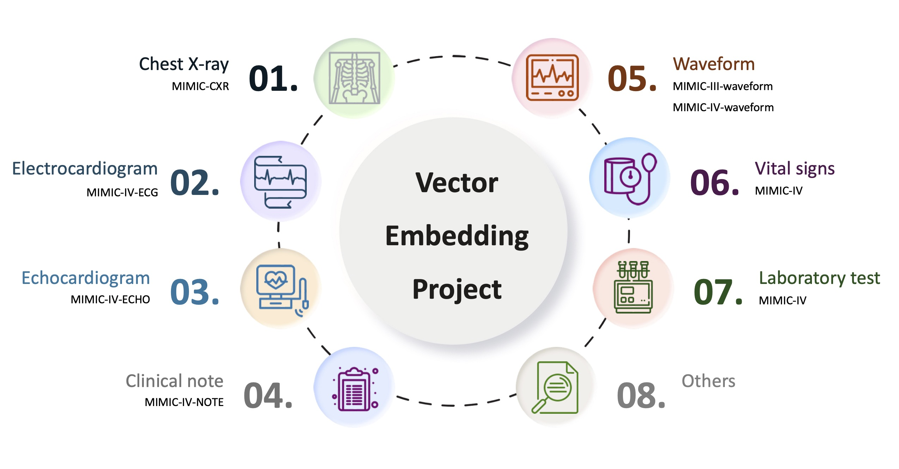
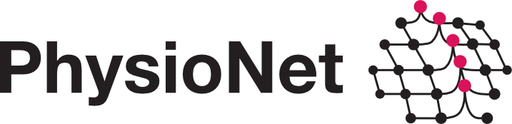

# Vector Embedding Project for Medical Data


## Overview

This repository provides comprehensive pipelines for generating vector embeddings from MIMIC III and MIMIC IV datasets, as well as related healthcare datasets. The primary focus is on creating high-quality vector representations that can be used for downstream machine learning tasks in healthcare AI research.



## Key Features

- **Multi-dataset Support**: Full compatibility with MIMIC III, MIMIC IV, and related healthcare datasets
- **State-of-the-art Models**: Integration with advanced embedding models including:
  - **EchoPrime**: Specialized for echocardiography data
  - **R3D-Transformer**: 3D ResNet-based transformer for temporal medical data
  - **PanEcho**: Pan-view echocardiography analysis model

## Data Access and Setup

### MIMIC Dataset Access

1. **Register for PhysioNet Access**:
   - Create an account at [PhysioNet](https://physionet.org/)
   - Complete the required training for human subjects research
   - Request access to MIMIC III and/or MIMIC IV datasets

2. **Download Datasets**:
   ```bash
   # Example for MIMIC IV version 3.1
   wget -r -N -c -np --user YOUR_USERNAME --ask-password \
     https://physionet.org/files/mimiciv/3.1/
   ```


## ECHO Model Information
### EchoPrime
- **Repository**: [https://github.com/echonet/EchoPrime](https://github.com/echonet/EchoPrime)
### R3D-Transformer
- **Repository**: [https://github.com/Team-Echo-MIT/r3d-v0-embeddings](https://github.com/Team-Echo-MIT/r3d-v0-embeddings)
### PanEcho
- **Repository**: [https://github.com/CarDS-Yale/PanEcho](https://github.com/CarDS-Yale/PanEcho)

## ECG Model Information
### HuBERT-ECG
- **Repository**: [https://github.com/Edoar-do/HuBERT-ECG?tab=readme-ov-file](https://github.com/Edoar-do/HuBERT-ECG?tab=readme-ov-file)
- **Hugging Face**: [https://huggingface.co/Edoardo-BS](https://huggingface.co/Edoardo-BS)
### ECGFM-KED
- **Repository**: [https://github.com/control-spiderman/ECGFM-KED](https://github.com/control-spiderman/ECGFM-KED)
### ECGFounder
- **Repository**: [https://github.com/PKUDigitalHealth/ECGFounder](https://github.com/PKUDigitalHealth/ECGFounder)
- **Hugging Face**: [https://huggingface.co/PKUDigitalHealth/ECGFounder/tree/main](https://huggingface.co/PKUDigitalHealth/ECGFounder/tree/main)


## Related Publications

- Johnson, A. E. W., et al. "MIMIC-IV, a freely accessible electronic health record dataset." Scientific Data 10.1 (2023): 1.
- Goldberger, A. L., et al. "PhysioBank, PhysioToolkit, and PhysioNet: components of a new research resource for complex physiologic signals." Circulation 101.23 (2000): e215-e220.


## License

This project is licensed under the MIT License - see the [LICENSE](LICENSE) file for details.

## Support and Contact

- **Issues**: [GitHub Issues](https://github.com/MIT-LCP/vector-embedding/issues)
- **Discussions**: [GitHub Discussions](https://github.com/MIT-LCP/vector-embedding/discussions)

## Organizations

| [](https://physionet.org/) | [](https://criticaldata.mit.edu/)|
|:---:|:---:|


</div>

## Acknowledgments
- **Funding**: This research was supported by a grant of the Korea Health Technology R&D Project through the Korea Health Industry Development Institute (KHIDI), funded by the Ministry of Health & Welfare, Republic of Korea (grant number: RS-2024-00439677)

---

**Disclaimer**: This software is provided for research purposes only. It is not intended for clinical use. Always comply with your institution's ethics and data usage policies when working with healthcare data.